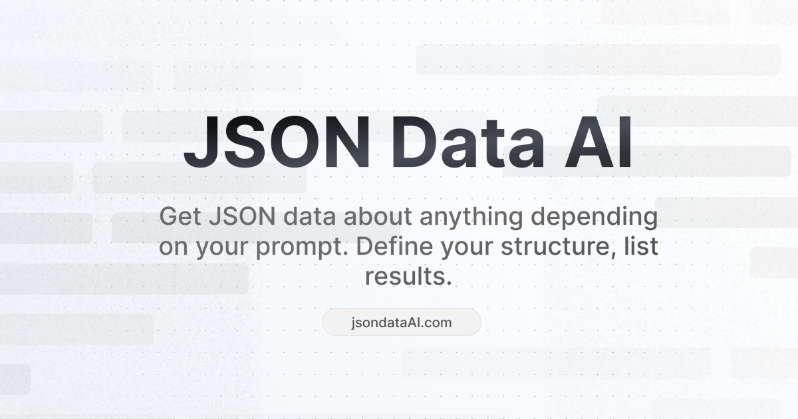

# JSON Data AI

Get JSON data about anything depending on your prompt. Define your structure, list results.

This repository includes the basic setup of JSONDataAI.com with the following stack:

- Vercel AI SDK
- Vercel VK Storage for rate limiting
- OpenAI GPT-4
- Shadcn UI
- Supabase
- React Hook Form for dynamic forms

### You liked the project?

<a href="https://www.buymeacoffee.com/enesozturk" target="_blank"></a>
<a href="https://cal.com/enes/json-data-ai?utm_source=banner&utm_campaign=oss
"></a>

## Get Started

Install the dependencies with your favorite package runner:

```sh
bun i
```

Create `.env.development` file;

```sh
# See https://vercel.com/docs/storage/vercel-kv to setup
KV_REST_API_READ_ONLY_TOKEN=
KV_REST_API_TOKEN=
KV_REST_API_URL=
KV_URL=

# Visit Supabase > [PROJECT] > Settings > API to get API key and app URL
SUPABASE_API_KEY=
NEXT_PUBLIC_SUPABASE_URL=
NEXT_PUBLIC_SUPABASE_ANON_KEY=$SUPABASE_API_KEY

# Visit https://platform.openai.com/account/api-keys to get API key
OPENAI_API_KEY=
```

Run the app:

```sh
bun run dev
```

### LICENCE

[MIT](./LICENCE)
